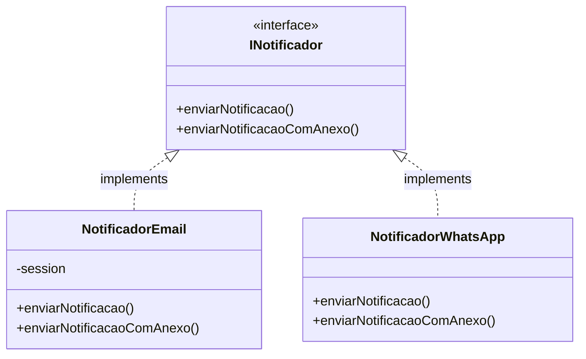
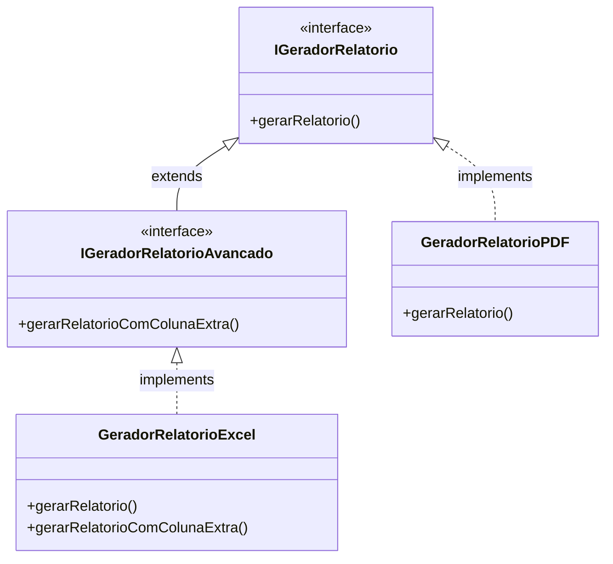
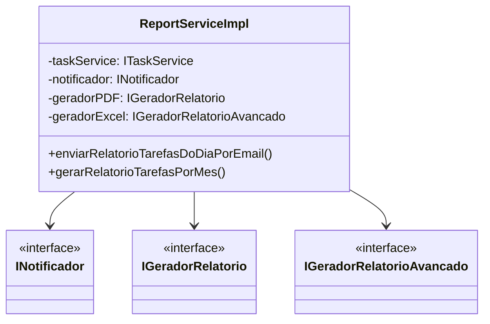

# Diagramas de Classes

## Sistema de Notificações



## Sistema de Relatórios



## ReportServiceImpl e Dependências



## Fluxo de Dependências (Inversão de Dependência)

```mermaid
graph TD
    Service[ReportServiceImpl]
    INot[<<interface>> INotificador]
    IGer[<<interface>> IGeradorRelatorio]
    IGerAdv[<<interface>> IGeradorRelatorioAvancado]
    
    Email[NotificadorEmail]
    PDF[GeradorRelatorioPDF]
    Excel[GeradorRelatorioExcel]

    Service --> INot
    Service --> IGer
    Service --> IGerAdv

    INot <|.. Email
    IGer <|.. PDF
    IGerAdv <|.. Excel
```
