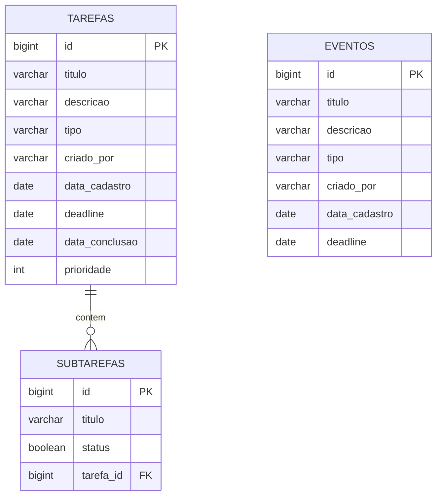

# Configuração do Banco de Dados

Este projeto utiliza um sistema de configuração externalizada para gerenciar as conexões com os bancos de dados.

## Arquivos de Configuração

### `database.properties`
Arquivo principal de configuração (não versionado por segurança).

**Localização**: `src/main/resources/database.properties`

### `database.properties.example`
Arquivo de exemplo com todas as configurações disponíveis.

## Como Configurar

1. **Copie o arquivo de exemplo**:
   ```bash
   cp src/main/resources/database.properties.example src/main/resources/database.properties
   ```

2. **Edite as configurações** no arquivo `database.properties`:
   ```properties
   # PostgreSQL
   db.url=jdbc:postgresql://localhost:5432/todolist
   db.user=seu_usuario
   db.password=sua_senha
   
   # Redis
   redis.host=localhost
   redis.port=6379
   
   # MongoDB
   mongo.uri=mongodb://localhost:27017
   mongo.database=todolist_logs
   ```

3. **Nunca commite** o arquivo `database.properties` (já está no `.gitignore`)

## Bancos de Dados Utilizados

### PostgreSQL (Principal)
- **Uso**: Armazenamento principal de dados (usuários, tarefas, eventos)
- **Porta padrão**: 5432
- **Banco**: `todolist`

### Redis (Cache)
- **Uso**: Cache de consultas frequentes
- **Porta padrão**: 6379

### MongoDB (Logs)
- **Uso**: Armazenamento de logs da aplicação
- **Porta padrão**: 27017
- **Database**: `todolist_logs`

## Classe de Configuração

A classe `br.com.todolist.util.DatabaseConfig` fornece métodos para acessar todas as configurações:

```java
DatabaseConfig.getDbUrl();       // URL do PostgreSQL
DatabaseConfig.getDbUser();      // Usuário do PostgreSQL
DatabaseConfig.getRedisHost();   // Host do Redis
DatabaseConfig.getMongoUri();    // URI do MongoDB
```

## Diagrama ER (Entidade-Relacionamento)


