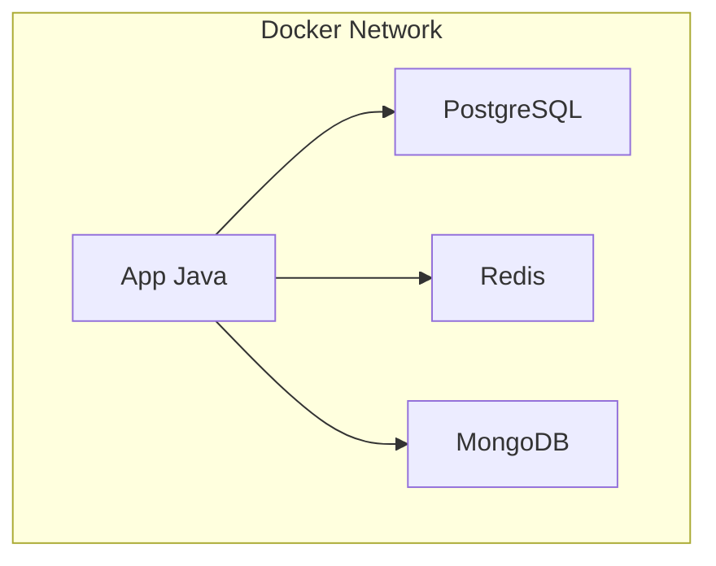

# 🐳 Docker - Guia Completo

Este guia consolida todas as informações necessárias para rodar o projeto usando Docker.

## 🚀 Início Rápido (Quickstart)

### 1. Instalar Docker (se necessário)
```bash
./scripts/install-docker.sh
# Depois: sair e entrar novamente na sessão para atualizar grupos
```

### 2. Iniciar Aplicação
Use o script auxiliar para subir todo o ambiente:
```bash
./scripts/docker-dev.sh up
```

### 3. Verificar Status
```bash
./scripts/docker-dev.sh status
```

**Pronto!** A aplicação está rodando com PostgreSQL, Redis e MongoDB.

---

## 🏗️ Estrutura do Docker Compose

O arquivo `docker-compose.yml` orquestra 4 serviços principais:

| Serviço | Imagem | Porta | Descrição |
|---------|--------|-------|-----------|
| **app** | Custom (Java 21) | - | Aplicação ToDoList (Backend/GUI) |
| **postgres** | postgres:16-alpine | 5432 | Banco de dados relacional |
| **redis** | redis:7-alpine | 6379 | Cache de dados |
| **mongodb** | mongo:7-jammy | 27017 | Logs de auditoria |

### Diagrama de Rede


---

## 🔧 Configuração e Inicialização do Banco

### Inicialização Automática (`init.sql`)
O container do PostgreSQL é configurado para executar automaticamente o script `init.sql` na primeira vez que o volume de dados é criado. Isso cria as tabelas e esquemas necessários.

### Volumes Persistentes
Os dados são persistidos em volumes Docker para não serem perdidos ao reiniciar os containers:
- `postgres-data`
- `mongodb-data`
- `redis-data`

---

## 🛠️ Comandos Úteis (`docker-dev.sh`)

O script `scripts/docker-dev.sh` facilita o gerenciamento:

```bash
./scripts/docker-dev.sh up          # Inicia containers
./scripts/docker-dev.sh down        # Para containers
./scripts/docker-dev.sh restart     # Reinicia containers
./scripts/docker-dev.sh logs        # Mostra logs de todos
./scripts/docker-dev.sh db-shell    # Acessa PostgreSQL CLI
./scripts/docker-dev.sh mongo-shell # Acessa MongoDB CLI
```

## 🐛 Troubleshooting

**Porta ocupada?**
Se a porta 5432 estiver em uso, pare o serviço local do Postgres ou altere o mapeamento no `docker-compose.yml`.

**Container não inicia?**
Verifique os logs: `./scripts/docker-dev.sh logs`
