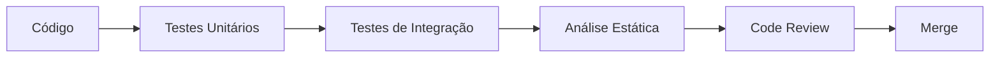

# Garantia de Qualidade de Software - To-Do List

## 📋 Visão Geral

Este documento descreve as práticas, ferramentas e processos de qualidade de software implementados no projeto To-Do List, incluindo testes automatizados, análise estática de código e métricas de qualidade.

## 🎯 Objetivos de Qualidade

- **Confiabilidade**: Garantir que o sistema funciona conforme esperado
- **Manutenibilidade**: Facilitar evolução e correção do código
- **Testabilidade**: Permitir validação automatizada de funcionalidades
- **Segurança**: Identificar e corrigir vulnerabilidades
- **Performance**: Manter código eficiente e otimizado

## 🧪 Testes Automatizados

### Cobertura de Testes

O projeto implementa múltiplas camadas de testes:

#### 1. Testes Unitários
- **Padrões de Projeto**
  - Singleton (`SessionManagerTest`)
  - Factory (`DefaultItemFactoryTest`)
  - Observer (`EventAuditObserverTest`)
  - Strategy (`NotificationStrategyTest`, `ReportStrategyTest`)

- **Camada de Serviço**
  - `UserServiceImplTest` - 100% de cobertura
  - `TaskServiceImplTest` - Todos os branches cobertos
  - `EventServiceImplTest` - 13 métodos testados
  - `ReportServiceImplTest` - Cenários de sucesso e falha

- **Camada de Controle**
  - `AuthControllerTest`
  - `TaskControllerTest`
  - `EventControllerTest`
  - `AppControllerTest`

- **Entidades**
  - `TarefaTest` - POJO completo
  - `EventoTest` - POJO completo
  - `UsuarioTest` - POJO completo

- **Utilitários**
  - `MensageiroTest` - Testes com GreenMail (servidor SMTP mockado)
  - `DefaultProgressCalculationStrategyTest`

#### 2. Testes de Integração
- **Repositórios PostgreSQL** (Testcontainers)
  - `TaskRepositoryIT`
  - `EventRepositoryPostgresTest`
  - `UserRepositoryPostgresTest`
  - `ServiceIntegrationTest` - Fluxo completo com banco real

#### 3. Testes de UI
- **Enterprise UI Testing**
  - `TelaLoginTest` - Dependency Injection + Mockito
  - `TelaCadastroTest` - Dependency Injection + Mockito
  - `TelaPrincipalTest` - Testes pragmáticos

### Ferramentas de Teste

| Ferramenta | Propósito | Versão |
|------------|-----------|--------|
| **JUnit 5** | Framework de testes | 5.10.1 |
| **Mockito** | Mocking de dependências | 5.8.0 |
| **AssertJ** | Assertions fluentes | 3.24.2 |
| **Testcontainers** | Containers para testes de integração | 1.19.3 |
| **GreenMail** | Servidor SMTP para testes | 2.0.1 |
| **JaCoCo** | Cobertura de código | 0.8.11 |

### Executando os Testes

```bash
# Todos os testes
mvn test

# Testes com relatório de cobertura
mvn verify

# Testes específicos
mvn test -Dtest=TelaLoginTest

# Script automatizado (todos os testes + relatórios)
./run_tests.sh
```

### Relatórios de Cobertura

Os relatórios JaCoCo são gerados em:
- **HTML**: `target/site/jacoco/index.html`
- **XML**: `target/site/jacoco/jacoco.xml` (para CI/CD)

## 🔍 Análise Estática - SonarQube

### Configuração

O projeto está integrado com SonarQube para análise contínua de qualidade de código.

#### Métricas Analisadas

1. **Bugs**: Problemas que podem causar comportamento incorreto
2. **Vulnerabilidades**: Falhas de segurança
3. **Code Smells**: Problemas de manutenibilidade
4. **Duplicação**: Código duplicado
5. **Cobertura**: Percentual de código testado
6. **Complexidade**: Complexidade ciclomática

### Executando Análise Local

```bash
# Análise com SonarQube local (Docker)
mvn clean verify sonar:sonar \
  -Dsonar.host.url=http://localhost:9000 \
  -Dsonar.login=seu-token
```

### Correções Implementadas

Documentação completa das correções do SonarQube em:
- [`docs/03-development/SONARQUBE_FIXES.md`](../03-development/SONARQUBE_FIXES.md)

### Padrões de Qualidade Seguidos

#### Clean Code
- Métodos pequenos e focados (máx. 50 linhas)
- Nomes descritivos e significativos
- Evitar números mágicos
- Constantes em UPPER_CASE
- Tratamento adequado de exceções

#### SOLID Principles
- **S**ingle Responsibility: Cada classe tem uma responsabilidade única
- **O**pen/Closed: Aberto para extensão, fechado para modificação
- **L**iskov Substitution: Subclasses podem substituir classes base
- **I**nterface Segregation: Interfaces específicas e coesas
- **D**ependency Inversion: Dependência de abstrações, não implementações

## 📊 Métricas de Qualidade

### Meta de Cobertura
- **Objetivo**: ≥ 80% de line coverage
- **Atual**: Verificar em `target/site/jacoco/index.html`

### Complexidade Ciclomática
- **Limite**: ≤ 10 por método
- **Recomendado**: ≤ 5 por método

### Duplicação de Código
- **Máximo**: < 3%
- **Meta**: < 1%

## 🔄 Processo de Qualidade

### 1. Desenvolvimento



### 2. Integração Contínua (CI)

Cada commit na branch `testes-automatizados` executa:
1. Compilação do projeto
2. Execução de todos os testes
3. Geração de relatórios de cobertura
4. Análise SonarQube (se configurado)

### 3. Padrões de Commit

```bash
# Formato
<tipo>: <descrição curta>

# Tipos
feat:     Nova funcionalidade
fix:      Correção de bug
test:     Adicionar ou modificar testes
refactor: Refatoração de código
docs:     Documentação
chore:    Tarefas de manutenção
```

## 🛠️ Ferramentas de Desenvolvimento

### Plugins Maven

```xml
<!-- Testes -->
<plugin>maven-surefire-plugin</plugin>

<!-- Cobertura -->
<plugin>jacoco-maven-plugin</plugin>

<!-- Análise Estática -->
<plugin>maven-checkstyle-plugin</plugin>
<plugin>spotbugs-maven-plugin</plugin>
<plugin>maven-pmd-plugin</plugin>
```

### IDE Configuration

Recomendado configurar:
- **Format on Save**: Formatação automática
- **Optimize Imports**: Remover imports não usados
- **Code Analysis**: Análise em tempo real

## 📈 Melhoria Contínua

### Práticas Recomendadas

1. **TDD (Test-Driven Development)**
   - Escrever teste antes da implementação
   - Red → Green → Refactor

2. **Code Reviews**
   - Todo código deve ser revisado
   - Foco em legibilidade e manutenibilidade

3. **Pair Programming**
   - Para problemas complexos
   - Transferência de conhecimento

4. **Refatoração Regular**
   - Melhorar código existente
   - Reduzir débito técnico

### Próximos Passos

- [ ] Aumentar cobertura de testes para ≥ 85%
- [ ] Integrar análise SonarQube no CI/CD
- [ ] Implementar testes de performance
- [ ] Adicionar testes de segurança (OWASP)
- [ ] Implementar mutation testing (PIT)

## 📚 Referências

- [JUnit 5 User Guide](https://junit.org/junit5/docs/current/user-guide/)
- [Mockito Documentation](https://javadoc.io/doc/org.mockito/mockito-core/latest/org/mockito/Mockito.html)
- [SonarQube Java Rules](https://rules.sonarsource.com/java)
- [Clean Code - Robert C. Martin](https://www.amazon.com/Clean-Code-Handbook-Software-Craftsmanship/dp/0132350882)
- [Test Driven Development - Kent Beck](https://www.amazon.com/Test-Driven-Development-Kent-Beck/dp/0321146530)

## 🤝 Contribuindo

Para manter a qualidade do projeto:

1. Execute testes localmente antes de commitar
2. Mantenha cobertura ≥ 80%
3. Siga os padrões de código estabelecidos
4. Documente funcionalidades complexas
5. Adicione testes para novos recursos

---

**Última atualização**: 2025-12-10
**Responsável**: Equipe de Qualidade
